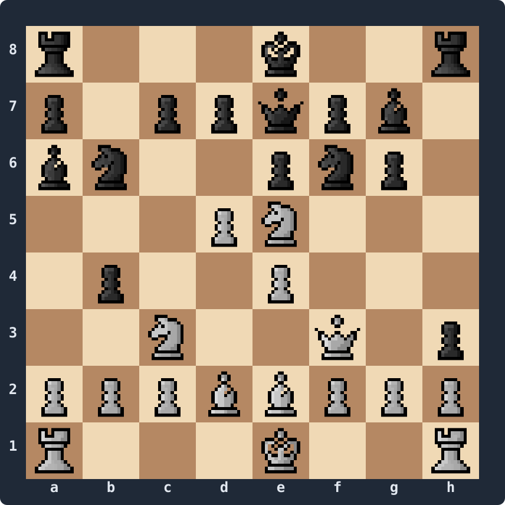

# Move Generation, Part 2 — Representing the Board

A position is more than pieces on squares. To play chess we need to track who's to move, whether either side can still castle, where en-passant captures are available, and a couple of counters for the draw rules. We need a representation that holds all of that and lets us answer two questions fast:

- *What pieces of type X does each side have, and where?* — for move generation.
- *What's on square N?* — for everything else (make/unmake, captures, evaluation, debugging).

We'll use **bitboards** for the first and an **8×8 mailbox** for the second.

## Why bitboards (briefly)

A bitboard is a 64-bit integer where each bit corresponds to one of the 64 squares. We keep one bitboard per piece type per colour: `WhitePawns`, `WhiteKnights`, ..., `BlackKing`. Twelve bitboards in total, 96 bytes.

The win: most chess questions become bitwise operations on 64 bits in parallel. *"Which empty squares can a white pawn push to?"* is `(whitePawns << 8) & ~allOccupied`. *"How many of our knights attack the king?"* is `popcount(knightAttacks[kingSq] & ourKnights)`. *"Is this piece pinned?"* is an XOR and a couple of slider lookups. We'll see these patterns again and again.

The cost: bitboards are bad at *"what's on square N?"* — answering it strictly from bitboards means AND-ing `1UL << N` against all twelve. So we keep a parallel **8×8 mailbox** — a `Piece[64]` indexed by square — that answers in one read. Stockfish, Crafty, and most modern bitboard engines do exactly this.

Mailbox-only and other piece-centric representations exist (10×12, 0x88, piece-lists), and they all work. But the rest of this series uses bitboards-plus-mailbox throughout.

## Square mapping: LERF

We need to agree which bit represents which square. We'll use **Little-Endian Rank-File** (LERF) — the convention in Stockfish and most teaching code:

```
56 57 58 59 60 61 62 63    8th rank
48 49 50 51 52 53 54 55    7th
40 41 42 43 44 45 46 47    6th
32 33 34 35 36 37 38 39    5th
24 25 26 27 28 29 30 31    4th
16 17 18 19 20 21 22 23    3rd
 8  9 10 11 12 13 14 15    2nd
 0  1  2  3  4  5  6  7    1st rank
 a  b  c  d  e  f  g  h
```

So `a1 = 0`, `h1 = 7`, `a8 = 56`, `h8 = 63`, and:

```csharp
int Square(int file, int rank) => rank * 8 + file;
int FileOf(int sq)             => sq & 7;
int RankOf(int sq)             => sq >> 3;
```

With LERF the direction shifts work out as: north `<< 8`, south `>> 8`, east `<< 1`, west `>> 1`, NE `<< 9`, NW `<< 7`, SE `>> 7`, SW `>> 9`. We'll need those constantly in later articles.

## The types

A flat `Piece` enum that doubles as a bitboard array index:

```csharp
public enum Piece : byte
{
    WhitePawn, WhiteKnight, WhiteBishop, WhiteRook, WhiteQueen, WhiteKing,
    BlackPawn, BlackKnight, BlackBishop, BlackRook, BlackQueen, BlackKing,
    None,
}
```

Castling rights pack neatly into four bits:

```csharp
using System;

[Flags]
public enum CastlingRights : byte
{
    None           = 0,
    WhiteKingside  = 1,
    WhiteQueenside = 2,
    BlackKingside  = 4,
    BlackQueenside = 8,
}
```

And the `Position` itself:

```csharp
public sealed class Position
{
    // 12 bitboards, indexed by (int)Piece (0..11)
    public ulong[] Pieces = new ulong[12];

    // 8×8 mailbox — Piece.None on empty squares
    public Piece[] Squares = new Piece[64];

    // Aggregate occupancy, kept in sync with Pieces
    public ulong WhiteOccupied;
    public ulong BlackOccupied;
    public ulong AllOccupied;

    // Irreversible state
    public bool           WhiteToMove;
    public CastlingRights Castling;
    public int            EpSquare;        // -1 if none
    public int            HalfmoveClock;
    public int            FullmoveNumber;
}
```

The bitboards are the source of truth; the mailbox is a cache. Same for `WhiteOccupied`, `BlackOccupied`, `AllOccupied` — we maintain them so we don't OR six bitboards together on every query. Everywhere we mutate `Pieces[..]` from now on, the mailbox and the occupancy bitboards must move in lockstep.

## Parsing FEN

FEN is six space-separated fields:

```
<placement> <side> <castling> <ep> <halfmove> <fullmove>
```

The placement lists ranks 8 down to 1, separated by `/`, with digits for runs of empty squares. Side is `w` or `b`. Castling is some subset of `KQkq` or `-`. EP is a square name (`e3`, `c6`, ...) or `-`. The last two are integers; some FENs (like the Kiwipete string we used in Part 1) drop them, and we default to `0` and `1`.

```csharp
using System;
using System.Text;

public static class Fen
{
    public const string Initial  = "rnbqkbnr/pppppppp/8/8/8/8/PPPPPPPP/RNBQKBNR w KQkq - 0 1";
    public const string Kiwipete = "r3k2r/p1ppqpb1/bn2pnp1/3PN3/1p2P3/2N2Q1p/PPPBBPPP/R3K2R w KQkq -";

    public static Position Parse(string fen)
    {
        var pos = new Position();
        Array.Fill(pos.Squares, Piece.None);

        string[] f = fen.Split(' ');
        if (f.Length < 4) throw new FormatException("FEN needs at least 4 fields");

        // 1. Placement — rank 8 first
        string[] ranks = f[0].Split('/');
        if (ranks.Length != 8) throw new FormatException("FEN needs 8 ranks");

        for (int i = 0; i < 8; i++)
        {
            int rank = 7 - i;
            int file = 0;
            foreach (char c in ranks[i])
            {
                if (char.IsDigit(c)) { file += c - '0'; continue; }
                int sq = rank * 8 + file++;
                Piece p = PieceFromChar(c);
                pos.Squares[sq] = p;
                pos.Pieces[(int)p] |= 1UL << sq;
            }
        }

        // 2. Side to move
        pos.WhiteToMove = f[1] == "w";

        // 3. Castling
        pos.Castling = CastlingRights.None;
        if (f[2] != "-")
            foreach (char c in f[2])
                pos.Castling |= c switch
                {
                    'K' => CastlingRights.WhiteKingside,
                    'Q' => CastlingRights.WhiteQueenside,
                    'k' => CastlingRights.BlackKingside,
                    'q' => CastlingRights.BlackQueenside,
                    _   => CastlingRights.None,
                };

        // 4. EP
        pos.EpSquare = f[3] == "-" ? -1 : SquareFromName(f[3]);

        // 5 & 6 — optional in some FENs
        pos.HalfmoveClock  = f.Length > 4 ? int.Parse(f[4]) : 0;
        pos.FullmoveNumber = f.Length > 5 ? int.Parse(f[5]) : 1;

        // Aggregate occupancy
        for (int p = (int)Piece.WhitePawn; p <= (int)Piece.WhiteKing; p++)
            pos.WhiteOccupied |= pos.Pieces[p];
        for (int p = (int)Piece.BlackPawn; p <= (int)Piece.BlackKing; p++)
            pos.BlackOccupied |= pos.Pieces[p];
        pos.AllOccupied = pos.WhiteOccupied | pos.BlackOccupied;

        return pos;
    }

    static Piece PieceFromChar(char c) => c switch
    {
        'P' => Piece.WhitePawn,  'N' => Piece.WhiteKnight, 'B' => Piece.WhiteBishop,
        'R' => Piece.WhiteRook,  'Q' => Piece.WhiteQueen,  'K' => Piece.WhiteKing,
        'p' => Piece.BlackPawn,  'n' => Piece.BlackKnight, 'b' => Piece.BlackBishop,
        'r' => Piece.BlackRook,  'q' => Piece.BlackQueen,  'k' => Piece.BlackKing,
        _   => throw new FormatException($"Unexpected piece char '{c}'"),
    };

    static int SquareFromName(string s) => (s[1] - '1') * 8 + (s[0] - 'a');
}
```

## Serialising back to FEN

We need the reverse direction to prove the parser works — and we'll use it in Part 6 for debugging make/unmake. Same logic, mirrored:

```csharp
public static class Fen
{
    public static string Write(Position pos)
    {
        var sb = new StringBuilder();

        // 1. Placement
        for (int rank = 7; rank >= 0; rank--)
        {
            int empties = 0;
            for (int file = 0; file < 8; file++)
            {
                Piece p = pos.Squares[rank * 8 + file];
                if (p == Piece.None) { empties++; continue; }
                if (empties > 0) { sb.Append(empties); empties = 0; }
                sb.Append(CharOf(p));
            }
            if (empties > 0) sb.Append(empties);
            if (rank > 0) sb.Append('/');
        }

        // 2. Side to move
        sb.Append(' ').Append(pos.WhiteToMove ? 'w' : 'b');

        // 3. Castling
        sb.Append(' ').Append(CastlingString(pos.Castling));

        // 4. EP
        sb.Append(' ').Append(pos.EpSquare < 0 ? "-" : SquareName(pos.EpSquare));

        // 5 & 6
        sb.Append(' ').Append(pos.HalfmoveClock);
        sb.Append(' ').Append(pos.FullmoveNumber);

        return sb.ToString();
    }

    static char CharOf(Piece p) => "PNBRQKpnbrqk."[(int)p];

    static string SquareName(int sq) =>
        $"{(char)('a' + (sq & 7))}{(char)('1' + (sq >> 3))}";

    static string CastlingString(CastlingRights c)
    {
        if (c == CastlingRights.None) return "-";
        var s = new StringBuilder(4);
        if ((c & CastlingRights.WhiteKingside)  != 0) s.Append('K');
        if ((c & CastlingRights.WhiteQueenside) != 0) s.Append('Q');
        if ((c & CastlingRights.BlackKingside)  != 0) s.Append('k');
        if ((c & CastlingRights.BlackQueenside) != 0) s.Append('q');
        return s.ToString();
    }
}
```

## A board printer that shows everything

The Part 1 printer only handled pieces. Now we'll print the full state:

```csharp
using System.Text;

public static class PositionPrinter
{
    public static string Render(Position pos)
    {
        var sb = new StringBuilder();

        for (int rank = 7; rank >= 0; rank--)
        {
            sb.Append(rank + 1).Append(' ');
            for (int file = 0; file < 8; file++)
            {
                Piece p = pos.Squares[rank * 8 + file];
                sb.Append(p == Piece.None ? '.' : "PNBRQKpnbrqk"[(int)p]);
                sb.Append(' ');
            }
            sb.AppendLine();
        }
        sb.AppendLine("  a b c d e f g h");

        sb.Append("Side to move:   ").AppendLine(pos.WhiteToMove ? "white" : "black");
        sb.Append("Castling:       ").AppendLine(Fen.Write(pos).Split(' ')[2]);
        sb.Append("En passant:     ").AppendLine(pos.EpSquare < 0 ? "-" : SquareName(pos.EpSquare));
        sb.Append("Halfmove clock: ").AppendLine(pos.HalfmoveClock.ToString());
        sb.Append("Fullmove:       ").AppendLine(pos.FullmoveNumber.ToString());

        return sb.ToString();
    }

    static string SquareName(int sq) =>
        $"{(char)('a' + (sq & 7))}{(char)('1' + (sq >> 3))}";
}
```

(We're cheekily borrowing the castling string from `Fen.Write` so we don't reimplement it. Refactor it to its own method if you'd rather.)

## Putting it together

```csharp
internal class Program
{
    static void Main()
    {
        var pos = Fen.Parse(Fen.Kiwipete);
        System.Console.WriteLine(PositionPrinter.Render(pos));

        string roundTripped = Fen.Write(pos);
        System.Console.WriteLine("Round-trip: " + roundTripped);
    }
}
```

Output:



```
Side to move:   white
Castling:       KQkq
En passant:     -
Halfmove clock: 0
Fullmove:       1
Round-trip: r3k2r/p1ppqpb1/bn2pnp1/3PN3/1p2P3/2N2Q1p/PPPBBPPP/R3K2R w KQkq - 0 1
```

The round-trip matches our input (modulo the `0 1` we filled in for the missing trailing fields).

The bitboards are populated and consistent: every set bit in `Pieces[(int)p]` corresponds to `Squares[sq] == p`, `AllOccupied` has exactly 32 bits set, and `WhiteOccupied & BlackOccupied == 0`. Part 5 introduces a `Validate()` method that asserts all this — invaluable once we start mutating state via `MakeMove` and `UnmakeMove`.

## What's next

Part 3 introduces the `Move` type — a 16-bit packed value carrying from-square, to-square, and a flag distinguishing the seven kinds of move chess needs to represent (quiet, double push, castle, capture, en-passant capture, promotion, promotion-capture). We'll also write a UCI-string helper so we can print and round-trip moves like `e2e4`, `e7e8q`, `e1g1`.
