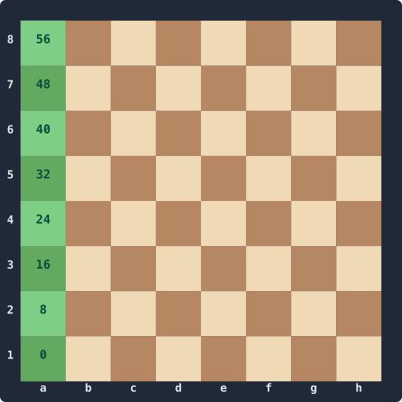
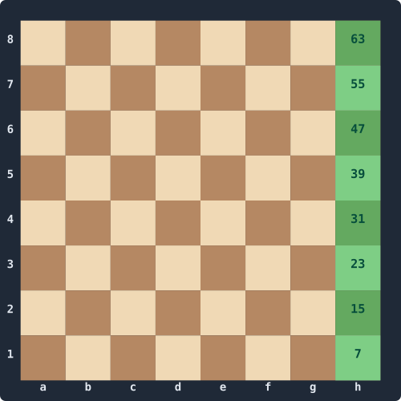
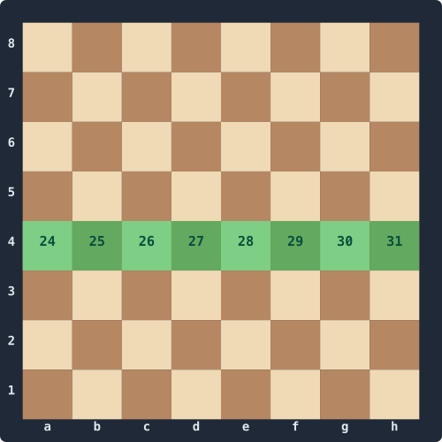
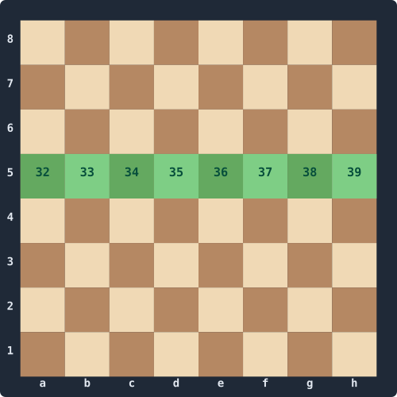
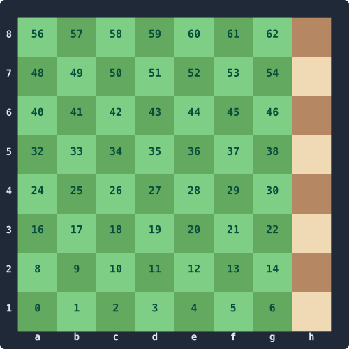
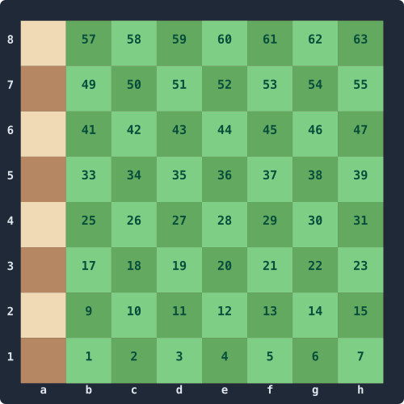
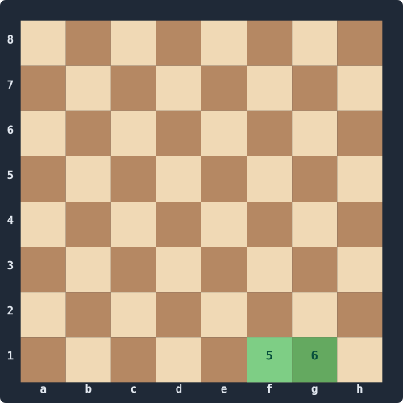
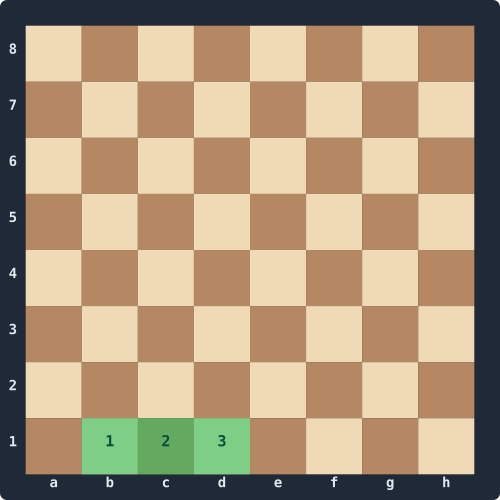
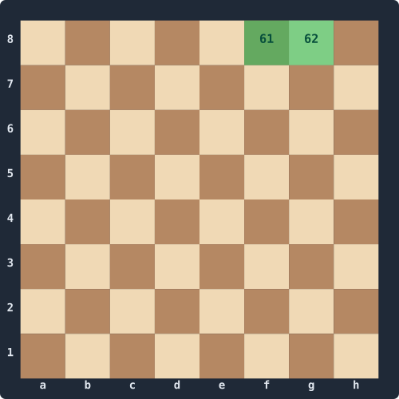
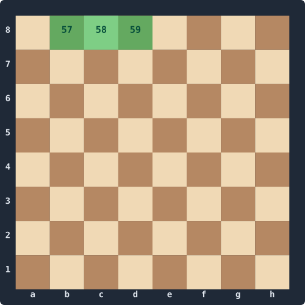

# Move Generation, Part 4 — Generating Pseudo-Legal Moves

This is the heart of the series. Given a `Position`, we want a function that returns every **pseudo-legal** move: every move that follows the rules of piece movement (pawns push, knights hop, sliders slide) without yet checking whether the result leaves the king in check. Legality comes in Part 7; today we just enumerate.

We'll work piece type by piece type. Pawns are fiddly because they have asymmetric capture rules; knights and the king need a tiny pre-computed table each; sliders need the classical ray-scan we mentioned in Part 1 (it'll get replaced by magic bitboards in Part 6).

By the end we'll be able to count exactly 20 legal moves from the initial position and (a few more than) 48 from Kiwipete.

## Setup: shifts, file masks, ray tables

Every shift you do across the board needs the right file mask to keep bits from wrapping. Let's put the constants and helpers somewhere we can reuse them.

```csharp
public static class Bitboards
{
    public const ulong FileA = 0x0101010101010101UL;
    public const ulong FileH = 0x8080808080808080UL;
    public const ulong NotA  = ~FileA;
    public const ulong NotH  = ~FileH;

    public const ulong Rank1 = 0x00000000000000FFUL;
    public const ulong Rank2 = 0x000000000000FF00UL;
    public const ulong Rank4 = 0x00000000FF000000UL;
    public const ulong Rank5 = 0x000000FF00000000UL;
    public const ulong Rank7 = 0x00FF000000000000UL;
    public const ulong Rank8 = 0xFF00000000000000UL;

    public static ulong ShiftN (ulong b) => b << 8;
    public static ulong ShiftS (ulong b) => b >> 8;
    public static ulong ShiftE (ulong b) => (b << 1) & NotA;
    public static ulong ShiftW (ulong b) => (b >> 1) & NotH;
    public static ulong ShiftNE(ulong b) => (b << 9) & NotA;
    public static ulong ShiftNW(ulong b) => (b << 7) & NotH;
    public static ulong ShiftSE(ulong b) => (b >> 7) & NotA;
    public static ulong ShiftSW(ulong b) => (b >> 9) & NotH;
}
```

A few of these as pictures — set bits in green with their LERF index. `FileA` and `FileH` are what guard against east/west wrap; `Rank4` and `Rank5` are the destination squares for double pushes.

| `FileA` `0x01…` | `FileH` `0x80…` |
|:--:|:--:|
|  |  |

| `Rank4` `0x…FF000000` | `Rank5` `0x000000FF…` |
|:--:|:--:|
|  |  |

And we'll need a place to keep the pre-computed attack tables — knight, king, pawn (per colour), and the eight ray-attack tables that the classical slider scan uses:

```csharp
using System.Numerics;

public static class Attacks
{
    // [square] → bitboard of squares attacked
    public static readonly ulong[] Knight = new ulong[64];
    public static readonly ulong[] King   = new ulong[64];

    // [colour, square]
    public static readonly ulong[,] Pawn = new ulong[2, 64];

    // [direction, square] — ray from sq in dir, excluding sq itself, to the board edge
    public static readonly ulong[,] Ray = new ulong[8, 64];

    public const int N = 0, NE = 1, E = 2, SE = 3, S = 4, SW = 5, W = 6, NW = 7;

    static Attacks()
    {
        InitKnight();
        InitKing();
        InitPawn();
        InitRays();
    }
}
```

The static constructor runs the first time any caller touches `Attacks`. From this point on everything is just lookups and bit-twiddling.

### Knight table

The knight has eight L-shaped jumps. We compute the attack bitboard for a single knight by shifting and masking; that same code initialises the table:

```csharp
static ulong KnightAttacksOf(ulong knights)
{
    ulong l1 = (knights >> 1) & 0x7F7F7F7F7F7F7F7FUL;
    ulong l2 = (knights >> 2) & 0x3F3F3F3F3F3F3F3FUL;
    ulong r1 = (knights << 1) & 0xFEFEFEFEFEFEFEFEUL;
    ulong r2 = (knights << 2) & 0xFCFCFCFCFCFCFCFCUL;
    ulong h1 = l1 | r1;
    ulong h2 = l2 | r2;
    return (h1 << 16) | (h1 >> 16) | (h2 << 8) | (h2 >> 8);
}

static void InitKnight()
{
    for (int sq = 0; sq < 64; sq++)
        Knight[sq] = KnightAttacksOf(1UL << sq);
}
```

The four hex constants are wrap masks — the squares that *survive* a `>> 1` / `>> 2` / `<< 1` / `<< 2` shift without wrapping around the edge of the board. `0x7F7F…` is "everywhere except file H"; `0xFEFE…` is "everywhere except file A":

| `0x7F7F7F7F7F7F7F7F` (no H) | `0xFEFEFEFEFEFEFEFE` (no A) |
|:--:|:--:|
|  |  |

`0x3F3F…` and `0xFCFC…` are the same idea two files wide (no G+H, no A+B respectively) for the `>> 2` / `<< 2` shifts.

### King table

The king attacks all Moore-neighbours — a parallel-prefix trick gets all eight directions in six operations:

```csharp
static ulong KingAttacksOf(ulong k)
{
    ulong horiz = Bitboards.ShiftE(k) | Bitboards.ShiftW(k);
    k |= horiz;
    return horiz | Bitboards.ShiftN(k) | Bitboards.ShiftS(k);
}

static void InitKing()
{
    for (int sq = 0; sq < 64; sq++)
        King[sq] = KingAttacksOf(1UL << sq);
}
```

### Pawn attack table

We index by colour because a white pawn on e4 attacks d5 and f5 — a *black* pawn on e4 would attack d3 and f3. Different colours, different directions:

```csharp
static void InitPawn()
{
    for (int sq = 0; sq < 64; sq++)
    {
        ulong b = 1UL << sq;
        Pawn[0, sq] = Bitboards.ShiftNE(b) | Bitboards.ShiftNW(b);   // white
        Pawn[1, sq] = Bitboards.ShiftSE(b) | Bitboards.ShiftSW(b);   // black
    }
}
```

### Ray tables

For each (direction, square) we want the ray of squares from `sq` toward the board edge in `dir`, excluding `sq` itself. Direction order is `{N, NE, E, SE, S, SW, W, NW}`:

```csharp
static void InitRays()
{
    int[] dr = {  1,  1,  0, -1, -1, -1,  0,  1 };  // rank delta
    int[] df = {  0,  1,  1,  1,  0, -1, -1, -1 };  // file delta

    for (int dir = 0; dir < 8; dir++)
        for (int sq = 0; sq < 64; sq++)
        {
            int r = sq >> 3, f = sq & 7;
            ulong ray = 0;
            for (;;)
            {
                r += dr[dir];
                f += df[dir];
                if ((uint)r > 7 || (uint)f > 7) break;
                ray |= 1UL << (r * 8 + f);
            }
            Ray[dir, sq] = ray;
        }
}
```

## Sliders by classical ray-scan

A rook from `sq` in direction `dir` attacks everything along the ray, up to and including the first blocker. That's expressed as:

```csharp
// Direction-increasing (N, NE, E, NW) — first blocker is the LSB
static ulong PositiveRay(int sq, int dir, ulong occ)
{
    ulong a = Ray[dir, sq];
    ulong blockers = a & occ;
    if (blockers != 0)
        a ^= Ray[dir, BitOperations.TrailingZeroCount(blockers)];
    return a;
}

// Direction-decreasing (S, SE, W, SW) — first blocker is the MSB
static ulong NegativeRay(int sq, int dir, ulong occ)
{
    ulong a = Ray[dir, sq];
    ulong blockers = a & occ;
    if (blockers != 0)
        a ^= Ray[dir, 63 - BitOperations.LeadingZeroCount(blockers)];
    return a;
}

// (If you're porting to a language without a 64-bit leading-zero intrinsic
// — Python, Lua, vanilla JavaScript on BigInts — a 6-step bisection works:
// halve the search range each iteration by testing whether the high 32 bits
// are set, then the high 16 of the remainder, then 8, etc. Same answer,
// roughly the same speed, no host primitives required.)

public static ulong RookAttacks(int sq, ulong occ)
    =>  PositiveRay(sq, N,  occ)
      | NegativeRay(sq, S,  occ)
      |  PositiveRay(sq, E, occ)
      | NegativeRay(sq, W,  occ);

public static ulong BishopAttacks(int sq, ulong occ)
    =>  PositiveRay(sq, NE, occ)
      | NegativeRay(sq, SE, occ)
      |  PositiveRay(sq, NW, occ)
      | NegativeRay(sq, SW, occ);

public static ulong QueenAttacks(int sq, ulong occ)
    => RookAttacks(sq, occ) | BishopAttacks(sq, occ);
```

The XOR trick is worth pausing on. `Ray[dir, sq]` is everything from sq to the edge. `Ray[dir, blockerSq]` is everything from the blocker to the edge — i.e. the part *past* the blocker. XOR removes that part, leaving the squares from sq up to and including the blocker.

It's slow in absolute terms — up to four bitscans per slider — but it's correct, easy to read, and will keep the perft numbers honest while we put together magic bitboards in Part 6.

### Square attacked by — the legality primitive

While we're here, a routine we'll use in Parts 5 and 7: "is square X attacked by side Y?" The trick is to ask "what would a piece on X be attacked by?" — shoot each piece-type's attack pattern out from X, intersect with the enemy pieces of that type.

```csharp
public static bool IsAttackedBy(Position pos, int sq, int byColor)
{
    ulong occ = pos.AllOccupied;

    ulong pawns   = pos.Pieces[(int)(byColor == 0 ? Piece.WhitePawn   : Piece.BlackPawn)];
    ulong knights = pos.Pieces[(int)(byColor == 0 ? Piece.WhiteKnight : Piece.BlackKnight)];
    ulong bishops = pos.Pieces[(int)(byColor == 0 ? Piece.WhiteBishop : Piece.BlackBishop)];
    ulong rooks   = pos.Pieces[(int)(byColor == 0 ? Piece.WhiteRook   : Piece.BlackRook)];
    ulong queens  = pos.Pieces[(int)(byColor == 0 ? Piece.WhiteQueen  : Piece.BlackQueen)];
    ulong king    = pos.Pieces[(int)(byColor == 0 ? Piece.WhiteKing   : Piece.BlackKing)];

    // Pawn lookup uses the *opposite* colour's table.
    if ((Pawn[1 - byColor, sq]   & pawns)   != 0) return true;
    if ((Knight[sq]              & knights) != 0) return true;
    if ((King[sq]                & king)    != 0) return true;
    if ((BishopAttacks(sq, occ)  & (bishops | queens)) != 0) return true;
    if ((RookAttacks  (sq, occ)  & (rooks   | queens)) != 0) return true;

    return false;
}
```

We try the cheap pieces first and short-circuit. Slider lookups go last because they're the most expensive — at least for now.

## The generator

We'll use a `Span<Move>` buffer the caller owns. Each per-piece generator appends moves and returns the new index. The maximum legal position has 218 moves, so a 256-element buffer is always enough.

```csharp
public static class MoveGenerator
{
    public static int GeneratePseudoLegal(Position pos, Span<Move> dest)
    {
        int n = 0;
        if (pos.WhiteToMove)
        {
            n = GenWhitePawns (pos, dest, n);
            n = GenKnights    (pos, dest, n, Piece.WhiteKnight);
            n = GenSliders    (pos, dest, n, Piece.WhiteBishop, isBishop: true);
            n = GenSliders    (pos, dest, n, Piece.WhiteRook,   isBishop: false);
            n = GenSliders    (pos, dest, n, Piece.WhiteQueen,  isBishop: true);
            n = GenSliders    (pos, dest, n, Piece.WhiteQueen,  isBishop: false);
            n = GenKing       (pos, dest, n, Piece.WhiteKing);
            n = GenWhiteCastling(pos, dest, n);
        }
        else
        {
            n = GenBlackPawns (pos, dest, n);
            n = GenKnights    (pos, dest, n, Piece.BlackKnight);
            n = GenSliders    (pos, dest, n, Piece.BlackBishop, isBishop: true);
            n = GenSliders    (pos, dest, n, Piece.BlackRook,   isBishop: false);
            n = GenSliders    (pos, dest, n, Piece.BlackQueen,  isBishop: true);
            n = GenSliders    (pos, dest, n, Piece.BlackQueen,  isBishop: false);
            n = GenKing       (pos, dest, n, Piece.BlackKing);
            n = GenBlackCastling(pos, dest, n);
        }
        return n;
    }
}
```

Queens get hit twice — once as a "bishop", once as a "rook". We could special-case them but it's not worth the duplication.

### Knights, king

These are the simplest — pop each piece, look up its attacks, mask against own pieces, serialise to moves:

```csharp
static int GenKnights(Position pos, Span<Move> dest, int n, Piece us)
{
    ulong ours = pos.WhiteToMove ? pos.WhiteOccupied : pos.BlackOccupied;
    ulong enemy = pos.WhiteToMove ? pos.BlackOccupied : pos.WhiteOccupied;
    ulong knights = pos.Pieces[(int)us];

    while (knights != 0)
    {
        int from = BitOperations.TrailingZeroCount(knights);
        ulong attacks = Attacks.Knight[from] & ~ours;
        n = EmitTargets(dest, n, from, attacks, enemy);
        knights &= knights - 1;
    }
    return n;
}

static int GenKing(Position pos, Span<Move> dest, int n, Piece us)
{
    ulong ours  = pos.WhiteToMove ? pos.WhiteOccupied : pos.BlackOccupied;
    ulong enemy = pos.WhiteToMove ? pos.BlackOccupied : pos.WhiteOccupied;
    int from = BitOperations.TrailingZeroCount(pos.Pieces[(int)us]);
    ulong attacks = Attacks.King[from] & ~ours;
    return EmitTargets(dest, n, from, attacks, enemy);
}

static int EmitTargets(Span<Move> dest, int n, int from, ulong targets, ulong enemy)
{
    while (targets != 0)
    {
        int to = BitOperations.TrailingZeroCount(targets);
        MoveFlag flag = ((1UL << to) & enemy) != 0 ? MoveFlag.Capture : MoveFlag.Quiet;
        dest[n++] = new Move(from, to, flag);
        targets &= targets - 1;
    }
    return n;
}
```

### Sliders

Same shape — iterate pieces, compute attacks via classical ray-scan, mask, serialise:

```csharp
static int GenSliders(Position pos, Span<Move> dest, int n, Piece us, bool isBishop)
{
    ulong ours  = pos.WhiteToMove ? pos.WhiteOccupied : pos.BlackOccupied;
    ulong enemy = pos.WhiteToMove ? pos.BlackOccupied : pos.WhiteOccupied;
    ulong pieces = pos.Pieces[(int)us];
    ulong occ = pos.AllOccupied;

    while (pieces != 0)
    {
        int from = BitOperations.TrailingZeroCount(pieces);
        ulong attacks = isBishop
            ? Attacks.BishopAttacks(from, occ)
            : Attacks.RookAttacks  (from, occ);
        attacks &= ~ours;
        n = EmitTargets(dest, n, from, attacks, enemy);
        pieces &= pieces - 1;
    }
    return n;
}
```

### Pawns

Pawns earn their own function. We do all four kinds of move with bitboard shifts — single push, double push, east capture, west capture — and emit promotion variants when a target sits on rank 8 (or rank 1 for black).

```csharp
static int GenWhitePawns(Position pos, Span<Move> dest, int n)
{
    ulong pawns = pos.Pieces[(int)Piece.WhitePawn];
    ulong empty = ~pos.AllOccupied;
    ulong enemy = pos.BlackOccupied;

    // --- single pushes (non-promoting) ---
    ulong singles = Bitboards.ShiftN(pawns) & empty;
    ulong promoSingles = singles & Bitboards.Rank8;
    ulong quietSingles = singles & ~Bitboards.Rank8;

    n = EmitPawnTargets(dest, n, quietSingles, deltaFrom: -8, MoveFlag.Quiet);
    n = EmitPromotions (dest, n, promoSingles, deltaFrom: -8, capture: false);

    // --- double pushes ---
    ulong doubles = Bitboards.ShiftN(singles & Bitboards.Rank3) & empty;
    n = EmitPawnTargets(dest, n, doubles, deltaFrom: -16, MoveFlag.DoublePawnPush);

    // --- captures (no en-passant yet) ---
    ulong capE = Bitboards.ShiftNE(pawns) & enemy;
    ulong capW = Bitboards.ShiftNW(pawns) & enemy;

    n = EmitPawnTargets(dest, n, capE & ~Bitboards.Rank8, deltaFrom: -9, MoveFlag.Capture);
    n = EmitPawnTargets(dest, n, capW & ~Bitboards.Rank8, deltaFrom: -7, MoveFlag.Capture);
    n = EmitPromotions (dest, n, capE &  Bitboards.Rank8, deltaFrom: -9, capture: true);
    n = EmitPromotions (dest, n, capW &  Bitboards.Rank8, deltaFrom: -7, capture: true);

    // --- en-passant ---
    if (pos.EpSquare >= 0)
    {
        ulong epBB = 1UL << pos.EpSquare;
        ulong epE = Bitboards.ShiftNE(pawns) & epBB;
        ulong epW = Bitboards.ShiftNW(pawns) & epBB;
        n = EmitPawnTargets(dest, n, epE, deltaFrom: -9, MoveFlag.EnPassant);
        n = EmitPawnTargets(dest, n, epW, deltaFrom: -7, MoveFlag.EnPassant);
    }

    return n;
}

static int EmitPawnTargets(Span<Move> dest, int n, ulong targets, int deltaFrom, MoveFlag flag)
{
    while (targets != 0)
    {
        int to = BitOperations.TrailingZeroCount(targets);
        dest[n++] = new Move(to + deltaFrom, to, flag);
        targets &= targets - 1;
    }
    return n;
}

static int EmitPromotions(Span<Move> dest, int n, ulong targets, int deltaFrom, bool capture)
{
    int baseFlag = capture ? (int)MoveFlag.PromoCaptureKnight : (int)MoveFlag.PromoteKnight;
    while (targets != 0)
    {
        int to = BitOperations.TrailingZeroCount(targets);
        int from = to + deltaFrom;
        for (int i = 0; i < 4; i++)   // N, B, R, Q
            dest[n++] = new Move(from, to, (MoveFlag)(baseFlag + i));
        targets &= targets - 1;
    }
    return n;
}
```

`Bitboards.Rank3` is the mask `0x0000000000FF0000UL` — we need it for the double-push trick. Add it to `Bitboards` alongside the others if you haven't already.

The trick for double pushes is worth a moment: white double-push targets are *rank-4 squares whose rank-3 transit was also empty*. So we take the single-push target set, mask to rank 3, push it once more, and AND with empty. The double-shift through rank 3 is what guarantees the transit square was empty.

Black is the mirror — shift south instead of north, swap rank constants, swap colour. Same shape:

```csharp
static int GenBlackPawns(Position pos, Span<Move> dest, int n)
{
    ulong pawns = pos.Pieces[(int)Piece.BlackPawn];
    ulong empty = ~pos.AllOccupied;
    ulong enemy = pos.WhiteOccupied;

    ulong singles = Bitboards.ShiftS(pawns) & empty;
    ulong promoSingles = singles & Bitboards.Rank1;
    ulong quietSingles = singles & ~Bitboards.Rank1;

    n = EmitPawnTargets(dest, n, quietSingles, +8, MoveFlag.Quiet);
    n = EmitPromotions (dest, n, promoSingles, +8, capture: false);

    ulong doubles = Bitboards.ShiftS(singles & Bitboards.Rank6) & empty;
    n = EmitPawnTargets(dest, n, doubles, +16, MoveFlag.DoublePawnPush);

    ulong capE = Bitboards.ShiftSE(pawns) & enemy;
    ulong capW = Bitboards.ShiftSW(pawns) & enemy;

    n = EmitPawnTargets(dest, n, capE & ~Bitboards.Rank1, +7, MoveFlag.Capture);
    n = EmitPawnTargets(dest, n, capW & ~Bitboards.Rank1, +9, MoveFlag.Capture);
    n = EmitPromotions (dest, n, capE &  Bitboards.Rank1, +7, capture: true);
    n = EmitPromotions (dest, n, capW &  Bitboards.Rank1, +9, capture: true);

    if (pos.EpSquare >= 0)
    {
        ulong epBB = 1UL << pos.EpSquare;
        ulong epE = Bitboards.ShiftSE(pawns) & epBB;
        ulong epW = Bitboards.ShiftSW(pawns) & epBB;
        n = EmitPawnTargets(dest, n, epE, +7, MoveFlag.EnPassant);
        n = EmitPawnTargets(dest, n, epW, +9, MoveFlag.EnPassant);
    }

    return n;
}
```

Add `Rank3 = 0x0000000000FF0000UL` and `Rank6 = 0x0000FF0000000000UL` to `Bitboards` if you haven't.

### Castling

For pseudo-legal we check the easy conditions — castling rights are intact and the squares between king and rook are empty. The "king isn't in check / transit square not attacked" checks come in Part 7.

```csharp
static int GenWhiteCastling(Position pos, Span<Move> dest, int n)
{
    ulong occ = pos.AllOccupied;

    if ((pos.Castling & CastlingRights.WhiteKingside)  != 0
        && (occ & 0x0000000000000060UL) == 0)   // f1, g1 empty
    {
        dest[n++] = new Move(4, 6, MoveFlag.KingsideCastle);
    }
    if ((pos.Castling & CastlingRights.WhiteQueenside) != 0
        && (occ & 0x000000000000000EUL) == 0)   // b1, c1, d1 empty
    {
        dest[n++] = new Move(4, 2, MoveFlag.QueensideCastle);
    }
    return n;
}

static int GenBlackCastling(Position pos, Span<Move> dest, int n)
{
    ulong occ = pos.AllOccupied;

    if ((pos.Castling & CastlingRights.BlackKingside) != 0
        && (occ & 0x6000000000000000UL) == 0)   // f8, g8 empty
    {
        dest[n++] = new Move(60, 62, MoveFlag.KingsideCastle);
    }
    if ((pos.Castling & CastlingRights.BlackQueenside) != 0
        && (occ & 0x0E00000000000000UL) == 0)   // b8, c8, d8 empty
    {
        dest[n++] = new Move(60, 58, MoveFlag.QueensideCastle);
    }
    return n;
}
```

The four magic constants are just the squares that have to be empty:

| White kingside `0x60` (f1, g1) | White queenside `0x0E` (b1, c1, d1) |
|:--:|:--:|
|  |  |

| Black kingside `0x6000000000000000` (f8, g8) | Black queenside `0x0E00000000000000` (b8, c8, d8) |
|:--:|:--:|
|  |  |

## Counting

```csharp
internal class Program
{
    static void Main()
    {
        Span<Move> buf = stackalloc Move[256];

        var initial = Fen.Parse(Fen.Initial);
        int n1 = MoveGenerator.GeneratePseudoLegal(initial, buf);
        System.Console.WriteLine($"Initial position: {n1} pseudo-legal moves");

        var kiwipete = Fen.Parse(Fen.Kiwipete);
        int n2 = MoveGenerator.GeneratePseudoLegal(kiwipete, buf);
        System.Console.WriteLine($"Kiwipete:         {n2} pseudo-legal moves");

        for (int i = 0; i < n1; i++) System.Console.Write(buf[i].ToUci() + " ");
        System.Console.WriteLine();
    }
}
```

We should see exactly `20` from the initial position — that's the canonical depth-1 perft value, and at depth 1 from the initial position pseudo-legal *is* legal (no checks possible). From Kiwipete we should see exactly `48` too — Kiwipete is famous for the pins and discovered checks it produces at deeper depths, but at depth 1 every white move happens to be legal.

That makes counts at depth 1 a poor differentiator. Part 5 plugs this generator into perft and goes deeper, where pseudo-legal will start diverging from legal and we'll need a filter.

## What's next

Part 5: `MakeMove` and `UnmakeMove`. We'll save the irreversible state in a stack, mutate the position via XOR on the bitboards, keep the mailbox in sync, and handle the four special-move cases (castling, en-passant, promotion, double push). Then we plug the whole thing into the perft skeleton from Part 1 and start seeing real node counts.
